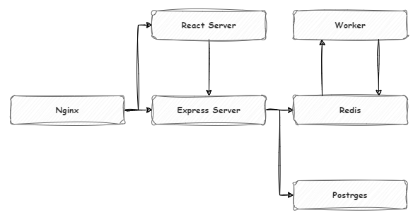

# App

## Diagram Dev

## Nginx

Nginx will forward traffic to express server avery request starts from /api

> /api will be added by nginx - inside express application we will use regular route path

Rest of traffic will be handle by react.
